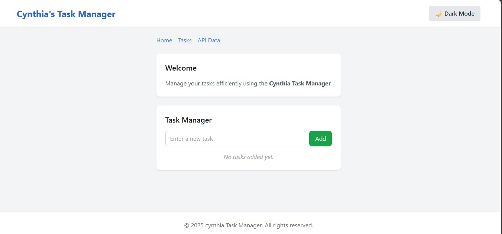
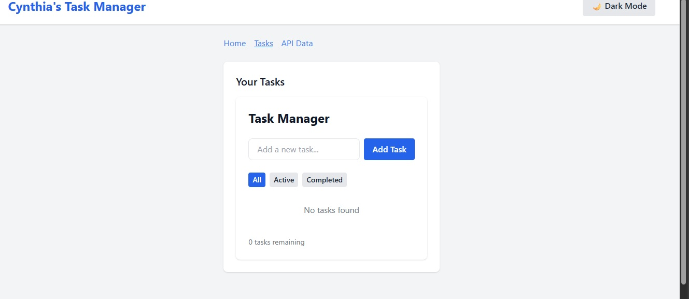
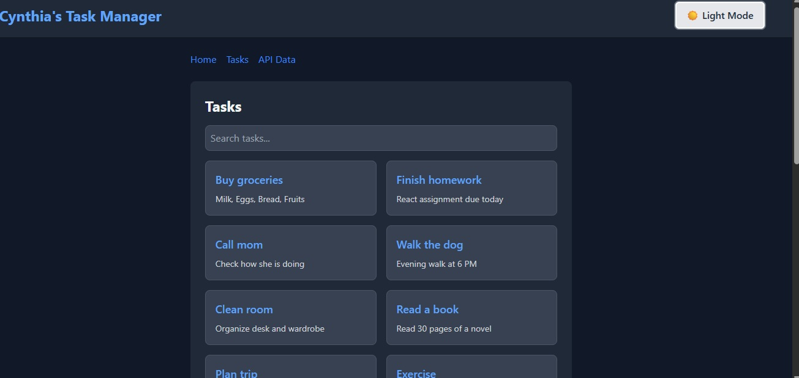

Cynthia Task Manager

A fully responsive React.js application using Tailwind CSS, demonstrating component architecture, state management with hooks, and API integration. This app allows users to manage tasks efficiently, filter tasks, search, and persist data locally.

Features

Add, complete, and delete tasks

Filter tasks by All, Active, or Completed

Search tasks dynamically

Tasks persist using localStorage

Dark/Light mode toggle using Tailwind CSS

Reusable UI components: Button, Card, Navbar, Footer

Responsive design for desktop, tablet, and mobile

Project Structure
src/
├── components/       # Reusable UI components (Button, Card, Navbar, Footer)

├── pages/            # Pages (Home.jsx, ApiData.jsx)

├── hooks/            # Custom hooks (useLocalStorageTasks)

├── context/          # React context providers (ThemeContext)

├── api/              # API integration functions (if needed)

├── utils/            # Utility functions
└── App.jsx           # Main application component

Getting Started

To run this project locally:

Clone the repository

git clone https://github.com/PLP-MERN-Stack-Development/react-js-jsx-and-css-mastering-front-end-development-Cynthia-tech48.git

Install dependencies

npm install

Start the development server

npm run dev

Open your browser and navigate to http://

Screenshots.

**1. Home / Welcome Page**  
  

**2. Task Manager**  
  

**3. API Data / Sample Tasks**  
  

Deployment

The app is deployed online and accessible at:
(https//task-manager-hazel-gamma-50.vercel.app)

Technologies Used

React.js – For building the user interface

Tailwind CSS – For styling and responsive design

Vite – Development build tool

localStorage – To persist task data

React Hooks – useState, useEffect, useContext, and custom hooks